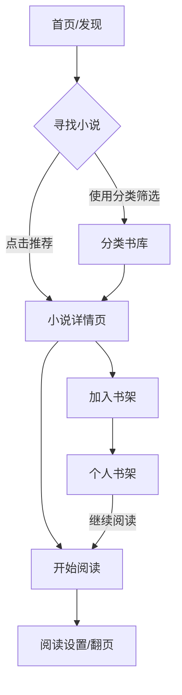

## 1. 产品概述
打造一个对标“起点中文网”的高质量在线网络小说阅读前端Web应用。
- 核心目的是为用户提供沉浸式的阅读体验、清晰的小说分类检索，以及便捷的个人书架管理。
- 面向热爱网络文学的读者，提供现代化、美观且响应式的跨设备阅读平台。

## 2. 核心功能

### 2.1 用户角色
| 角色 | 注册方式 | 核心权限 |
|------|---------------------|------------------|
| 访客 | 无需注册 | 浏览首页、排行榜、分类、详情页及试读章节 |
| 注册用户 | 邮箱/手机号注册 | 加入书架、记录阅读进度、全本阅读、评论互动 |

### 2.2 功能模块
1. **首页 (Home)**: 顶部导航、轮播推荐位、热门排行榜（月票榜/畅销榜）、主编力荐、最近更新。
2. **分类库 (Category)**: 多维度筛选组件（按题材、状态、字数、更新时间）、小说列表。
3. **小说详情页 (Detail)**: 封面、书名、作者、字数、状态、内容简介、最新章节、全书目录入口、评论区。
4. **阅读页 (Reader)**: 核心阅读区、目录侧边栏、阅读设置（字号、背景色、行距切换）、上下章翻页。
5. **个人书架 (Bookshelf)**: 收藏书籍列表、阅读进度追踪、书架管理（删除/置顶）。

### 2.3 页面详情
| 页面名称 | 模块名称 | 功能描述 |
|-----------|-------------|---------------------|
| 首页 | 推荐轮播图 | 定时自动切换的热门小说推荐，点击进入详情 |
| 首页 | 排行榜单 | 展示不同维度的前10名小说，悬浮显示详情卡片 |
| 分类库 | 筛选面板 | 提供多条件组合查询，无刷新加载列表 |
| 详情页 | 书籍信息卡 | 展示书籍基础元数据及“加入书架/立即阅读”主操作按钮 |
| 阅读页 | 阅读控制栏 | 悬浮或点击呼出的设置面板，支持主题切换（日间/夜间模式） |

## 3. 核心流程
核心用户路径：
1. 用户进入首页浏览推荐或榜单。
2. 通过分类库或搜索找到感兴趣的小说。
3. 进入详情页查看简介和目录。
4. 点击阅读进入阅读页，同时可选择加入书架。
5. 下次访问从书架直接恢复上次阅读进度。

## 4. UI/UX 设计

### 4.1 设计风格
- **主色调**: 经典红（#EE4259，类似起点红）作为强调色，搭配大面积的留白。
- **背景色**: 浅灰/纯白（日间模式），深灰/纯黑（夜间护眼模式）。
- **按钮风格**: 现代微圆角（rounded-md或rounded-lg），主按钮使用品牌红实心，次按钮使用描边或浅色背景。
- **字体**: 标题使用黑体/系统默认无衬线体（PingFang SC/Inter），正文阅读区支持切换至宋体/楷体等传统阅读字体。
- **排版**: 卡片式布局，阴影柔和，保持清晰的信息层级（封面图与文字的黄金比例）。

### 4.2 页面设计概览
| 页面名称 | 模块名称 | UI 元素 |
|-----------|-------------|-------------|
| 首页 | 导航栏 | 吸顶设计，Logo、分类链接、搜索框、登录/书架入口 |
| 详情页 | 头部信息区 | 模糊背景图 + 书籍高清封面立体展示，关键数据突出显示 |
| 阅读页 | 正文区 | 极致去噪，隐藏无关干扰，仅保留文字内容和页码/章节标题 |

### 4.3 响应式策略
- 桌面端优先：充分利用宽屏展示复杂的榜单、网格布局和侧边目录。
- 移动端适配：导航收起为汉堡菜单，列表转为单列，阅读页全屏沉浸且支持手势操作区域（点击中间呼出菜单，左右点击翻页）。
