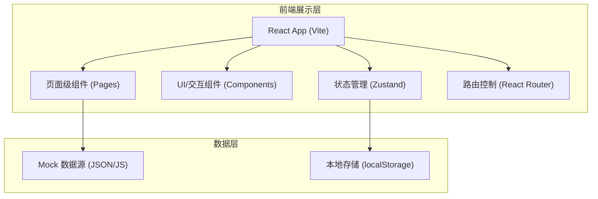

## 1. 架构设计



## 2. 技术描述
- **前端框架**: React@18
- **构建工具**: Vite
- **样式框架**: tailwindcss@3 (配合 `lucide-react` 提供图标，`framer-motion` 提供流畅过渡动画)
- **路由管理**: `react-router-dom` 
- **状态管理**: `zustand` (轻量级，非常适合管理书架和阅读偏好)
- **初始化工具**: vite-init

## 3. 路由定义
| 路由路径 | 页面组件 | 用途 |
|-------|---------|---------|
| `/` | `Home` | 首页：轮播推荐、分类导航、小说榜单 |
| `/category` | `Category` | 分类书库页：多条件组合筛选，列表渲染 |
| `/book/:id` | `BookDetail` | 详情页：书籍元信息、简介、目录 |
| `/read/:id/:chapterId` | `Reader` | 阅读页：小说正文沉浸式阅读、阅读设置、翻页控制 |
| `/bookshelf` | `Bookshelf` | 个人书架页：收藏的书籍及阅读进度追踪 |

## 4. 数据结构定义 (Mock)
由于项目主要为前端界面构建，数据流采用前端Mock及本地存储。

```typescript
// 书籍核心模型
interface Book {
  id: string;
  title: string;
  author: string;
  coverUrl: string;
  category: string;
  status: '连载' | '完结';
  wordCount: string;
  shortDesc: string;
  latestChapter: string;
  updateTime: string;
}

// 章节内容模型
interface Chapter {
  id: string;
  bookId: string;
  title: string;
  content: string[]; // 按段落拆分的文本数组
  chapterIndex: number;
}

// 书架记录模型 (存入 localStorage)
interface BookshelfItem {
  bookId: string;
  bookInfo: Book;
  lastReadChapterId: string;
  lastReadChapterTitle: string;
  addTimestamp: number;
}

// 阅读偏好设置 (存入 localStorage)
interface ReaderSettings {
  theme: 'day' | 'night' | 'sepia';
  fontSize: number;  // 例如：18 (px)
  fontFamily: string; // 例如：'sans', 'serif'
  lineHeight: number; // 例如：1.8
}
```

## 5. 存储架构设计
应用没有真实的后端数据库支持，核心业务数据在前端维护：
- **静态Mock数据**: 存放于 `src/mock/`，模拟 API 返回的书籍列表和章节正文内容。
- **持久化状态**: 通过 `zustand/middleware/persist` 将用户的 `BookshelfItem` 数组和 `ReaderSettings` 存储至浏览器的 `localStorage` 中，以便刷新或下次访问时不丢失。
